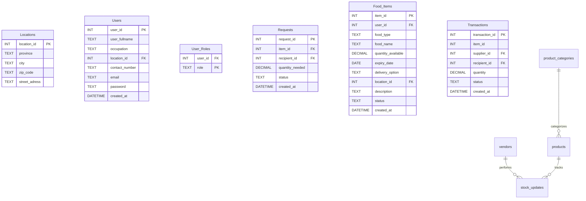

# FoodConnect
Connecting food suppliers with organizations that serve people in need.


## Group 7 Members
| **Name**         | **Student Number** |
|------------------|--------------------|
| Lané Smit        | **22820737**       |
| Cassidy Thersby  | **22591622**       |
| Carin de Beer    | **23757508**       |

   
## Project Purpose
The purpose of FoodConnect is to address the inefficiencies in South Africa’s food supply chain, particularly in the retail and agricultural sectors where food surplus is wasted while underserved communities face food insecurity. The digital platform is designed using Visual Studios and MySQL to connect food suppliers including farmers, shops, bakeries, and restaurants with recipient organisations such as underprivileged schools, shelters and non-governmental organisations. 
FoodConnect aims to improve inventory management and customer fulfilment by providing real-time visibility of surplus stock and streamlined communication between suppliers and recipients. This reduces the need for manual processes such as phone calls and emails, ensuring surplus food reaches those in need efficiently. 
The platform contributes to a social, economic and environmental sustainability for South Africa. Socially, it improves access to food in the underserved communities by improving redistribution. To reduce food insecurity. Economically, it reduces waste disposal costs for suppliers. Environmentally, less food is wasted therefore less resources are needed to produce more food. 
FoodConnect aims to create a more connected and sustainable food supply chain. With the use of technology, businesses are given the platform to operate more efficiently and in a more sustainable manner, having a positive social impact for South Africa. Through FoodConnect, surplus food is used as a resource instead of becoming waste. 


## Features
- **Main Dashboard - index.html**: The index page shows the impact that FoodConnect has on the community, featuring a Sign Up and Log In option. 
+ **About Us Information Page**: This page provides information about what FoodConnect is and their mission. 
- **Sign up and Login Pages**: Allow users to create an account or log into their dashboard. 
+ **Supplier and Recipient Dashboards**: The **supplier** dashboard allows users to view the current inventory. The **recipient** dashboard allows those in need to upload food requests and view available food surplus items. 
- **Inventory Tracking**: Can be viewed from the **supplier** dashboard.
+ **Available Food Surplus**: Can be viewed from the **recipient** dashboard.


## Database Setup

### Using SQLite Command Line
1. Open command prompt/terminal in the project directory
2. Run the SQL commands:
   ```bash
   sqlite3 foodconnect.db < foodconnect.sql
   (Optional: .read foodconnect.sql)
   ```


## Database Schema

### Entity Relationship Diagram (ERD)



The database includes the following tables and views:

### Tables !!!
1. **suppliers**: Registered food suppliers and their information
2. **recipients**: Registered recipients in need of food and their information
3. **food_surplus**: Available food product type, description, quantity with supplier name, location and contact information.
4. **food_requests** 

### Views !!!
1. **low_stock_products**: View of products with low stock alerts
2. **inventory_summary**: Summary statistics for the dashboard


## Database Demonstration
The foodconnect.sql migration file was executed successfully in SQLite to create and populate the foodconnect.db database.
It includes four normalized tables (suppliers, recipients, food_surplus, and food_requests) linked by foreign keys.
Sample data was inserted into each table (5 records per table) to demonstrate supplier-to-recipient food supply chain interactions.
The successful execution was verified using SELECT COUNT(*) queries, confirming that all tables contain sample data.


## Sample Data
The database includes the following data types:

- **2 Users** : Suppliers and Recipients
- **6 Occupation Types** : Restaurant, Grocery Store, Farm, Bakery, Manufacturer, Other
- **8 Food Types** : Vegetables, Fruit, Meat, Dairy, Starch, Bakery, Beverages, Other
- **4 Unit Types** : kg, litres, boxes, items

Other data on the **Supplier dashboard** includes:
- An Impact Overview showing the number of surplus items uploaded, recipients helped, and the amount (in kg) of food donated.
- A Current Inventory display 
- An Order management display showing orders with their order numbers and status.
- Supply chain analytics such as order fulfilment rate and a monthly distribution trend. 

Other data on the **Recipient dashboard** includes the number of requests uploaded, recipients supported, and the total amount (in kg) of food received. 


## File Structure
```
BFB Supply Chain/
|
├── templates/
|   ├── images/
|   |   └──background.png
|   |
|   ├── about.html                       # About us information page
|   ├── index.html                       # Main dashboard
|   ├── recipient-dashboard.html         # Main recipient dashboard
|   ├── recipientlogin.html              # Recipient login page
|   ├── signup.html                      # Sign up page
|   ├── supplier-dashboard.html          # Main supplier dashboard
|   ├── supplierlogin.html               # Recipient login page
|   ├── uploadfoodsurplus.html           # Upload available surplus food
|   ├── uploadrequest.html               # Request surplus food
|   ├── view-available-surplus.html      # View available surplus inventory
|   ├── view-recipient-needs.html        # View recipient food needs
└── readme.md                            # Explanation of project purpose, database schema and ERD. 
```

## Usage
1. Initialize the database using the SQLite command line method above.
2. Open `index.html` in your web browser.
3. Log into the website as either a supplier or recipient to access the respective dashboards.
4. Navigate through the different pages to request or upload available surplus food. 


## Technologies Used
- **Visual Studio Code**: Visual Studios was used to create html files to generate the frontend, and to integrate the sql database. 
- **HTML5**: Used to create the structure of the website. 
- **Bootstrap 5.3.8**: Used to create the user interface (UI) framework and styling
- **Bootstrap Icons**: Icon set was used in the design of our html files. 
- **SQLite**: Used to create the data base and draw up the ERDs.


## Browser Compatibility
The application works with all modern browsers that support HTML5 and CSS3, including:
- Chrome 90+
- Firefox 88+
- Safari 14+
- Edge 90+
